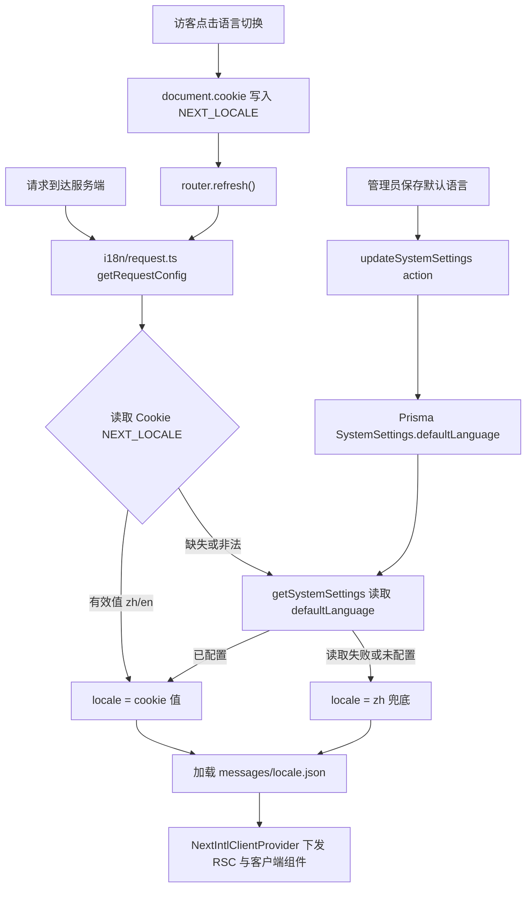

# i18n 国际化支持

Feature Name: i18n-support
Updated: 2026-08-25

## Description

为 Conan Nav 引入中英文双语国际化，采用 next-intl 无路由模式（Without i18n routing）：URL 保持干净（无 /en、/zh 前缀），语言由 Cookie 持久化，未设置 Cookie 的访客使用管理员在系统设置中配置的全局默认语言，兜底语言为 `zh`。前台公共页面与后台管理界面全部纳入改造，前后台共用同一语言偏好。

## Architecture



技术选型与理由：

- **next-intl（无路由模式）**：官方支持通过 `getRequestConfig` + Cookie 提供 locale，无需 `[locale]` 路由段，现有 `app/(public)`、`app/admin` 路由结构零改动，`middleware.ts` 保持纯认证逻辑。
- **语言解析链**：`NEXT_LOCALE` Cookie > `SystemSettings.defaultLanguage` > `zh`，与需求文档 R1/R3 一致。
- **切换即时生效**：客户端写 Cookie 后调用 `router.refresh()`，服务端组件按新 locale 重新渲染，页面地址与滚动位置保持不变。

## Components and Interfaces

### 1. i18n 基础设施（新增）

| 文件 | 职责 |
|------|------|
| `i18n/request.ts` | `getRequestConfig`：按解析链确定 locale，动态 import 对应 messages |
| `messages/zh.json` | 中文消息包（全量） |
| `messages/en.json` | 英文消息包（全量） |
| `types/i18n.d.ts` | `declare module 'next-intl'` 类型增强，key 拼写错误在编译期暴露 |

`next.config.js` 接入 `createNextIntlPlugin`。

消息命名空间规划：

```
common.*        通用词（确定/取消/加载中/暂无数据/操作失败...）
header.*        前台头部（搜索、分类、收录按钮...）
footer.*        前台底部
search.*        搜索页
category.*      分类页
notFound.*      404 页
admin.common.*  后台通用（重置/每页 N 条...）
admin.sidebar.* 侧边栏菜单与页面标题映射
admin.login.*   登录页
admin.dashboard.* 仪表盘与图表（含日期/星期格式化标签）
admin.sites.*   网站管理
admin.categories.* 分类管理
admin.users.*   系统设置
admin.data.*    数据管理
theme.*         主题切换提示
```

### 2. 根布局改造（`app/layout.tsx`）

- `<html lang>` 由静态 `"zh-CN"` 改为 `getLocale()` 动态输出（`zh-CN` / `en`）。
- `<body>` 内包一层 `NextIntlClientProvider`（服务端渲染时自动继承 request config 的 locale 与 messages）。

### 3. 语言切换组件（新增 `components/locale-toggle.tsx`）

- 交互模式对齐现有 `ThemeToggle`：ghost icon button + Tooltip，点击循环切换 zh ↔ en，附 toast 反馈。
- 实现：`useLocale()` 获取当前语言 → `document.cookie = "NEXT_LOCALE=xx;path=/;max-age=31536000;samesite=lax"` → `router.refresh()`。
- 挂载点一：前台 `components/layout/header.tsx` 主题切换按钮旁。
- 挂载点二：后台 `components/admin/admin-header.tsx`。

### 4. 全局默认语言配置（后端 + 设置页）

数据层（4 处同步新增 `defaultLanguage: "zh" | "en"`，默认 `"zh"`）：

- `prisma/schema.prisma` `SystemSettings` 模型 → 需 `db:push` 迁移
- `lib/prisma.ts` `SystemSettingsItem` 接口与 `initialSystemSettings`（JSON 兜底存储）
- `lib/client-settings.ts` `PublicSettings` 与 `defaultSettings`
- `lib/actions.ts` `updateSystemSettings` 参数与校验（zod `enum(["zh","en"])`）

界面层：`app/admin/users/page.tsx`（系统设置页）"基本设置"区新增"默认语言"Select（中文/English），保存走现有 settings action 链路；`app/api/settings/route.ts` 公开响应自动携带该字段。

### 5. 存量文案改造（约 30 个文件）

- 服务端组件：`getTranslations()` / `useTranslations()`（RSC 中直接调用 hook 形式）。
- 客户端组件："use client" 文件使用 `useTranslations("namespace")`。
- toast / aria-label / placeholder / sr-only 全部纳入。
- `admin-header.tsx` 页面标题映射、`admin-sidebar.tsx` 菜单项改为消息 key。
- 图表组件（`visit-frequency-chart.tsx` 等）中手写中文星期、"N 次"等单位词改用消息插值（ICU `{count, plural, ...}` 或 `{count}` 模板）。
- 数据库业务内容（网站名、描述、分类名）与第三方诗词 API 返回值原样展示，保持现状。

### 6. 元数据本地化（`app/layout.tsx` `generateMetadata`）

- `description` 兜底文案通过 `getTranslations()` 按当前 locale 输出；管理员自定义的 `siteName`/`siteDescription` 优先，维持现状优先级。

## Data Models

```prisma
model SystemSettings {
  // ...现有字段
  defaultLanguage  String   @default("zh") @map("default_language")
}
```

无其他模型变更。语言偏好不落库，仅存于访客 Cookie。

## Correctness Properties

1. 解析链恒定：任意请求的 locale ∈ {zh, en}，且永远可解析（Cookie 非法 → 全局默认 → zh）。
2. Cookie 偏好优先于全局默认：管理员改默认语言后，已选语言的访客界面保持访客偏好。
3. 前后台共享同一 `NEXT_LOCALE` Cookie，一处切换两处一致。
4. URL 恒定：语言切换前后 pathname 与查询参数完全一致。
5. 消息 key 完备性：`zh.json` 为权威 key 集，`en.json` 缺失 key 时 next-intl 报错并在开发期可见（配合类型增强在编译期拦截）；`messages` 更新与组件引用同步演进。

## Error Handling

| 场景 | 处理 |
|------|------|
| Cookie 值非法（如 `NEXT_LOCALE=fr`） | 忽略，走全局默认语言 |
| `getSystemSettings` 在 request config 中抛错 | 捕获并回退 `zh`，保证页面可渲染 |
| en 包缺失某 key | 开发期 next-intl 控制台报错；生产回退展示 key 路径，构建前置校验规避上线 |
| 数据库无 defaultLanguage 列（旧库未迁移） | `db:push` 迁移 + 字段默认值 `"zh"` 保证旧行为不变 |

## Test Strategy

1. **类型校验**：`npm run build` 通过（含 messages 类型增强对 key 的编译期检查）。
2. **Lint**：`npm run lint` 通过。
3. **手动验证矩阵**：
   - 无 Cookie 访客 → 渲染管理员配置的默认语言；改默认语言后刷新立即生效。
   - 前台 header 切换 → 界面即时切换、URL 不变、刷新后保持。
   - 后台 header 切换 → 前后台一致；登录页在无 Cookie 时跟随全局默认。
   - 非法 Cookie（curl 设置 `NEXT_LOCALE=xx`）→ 回退默认语言，`<html lang>` 正确。
   - en 环境下后台 toast、表单校验、图表标签、404 页全部英文。
4. **回归**：主题切换、网站收录、admin 登录/CRUD/数据导入导出功能不受影响。

## References

[^1]: (Website) - [next-intl: App Router without i18n routing / cookie-based locale](https://next-intl.dev/docs/getting-started/app-router/without-i18n-routing)
[^2]: (Filename) - `middleware.ts` 认证中间件（本次零改动）
[^3]: (Filename#L64) - `prisma/schema.prisma` SystemSettings 模型（新增 defaultLanguage）
[^4]: (Filename) - `components/theme-toggle.tsx` 语言切换组件的交互范式参照
