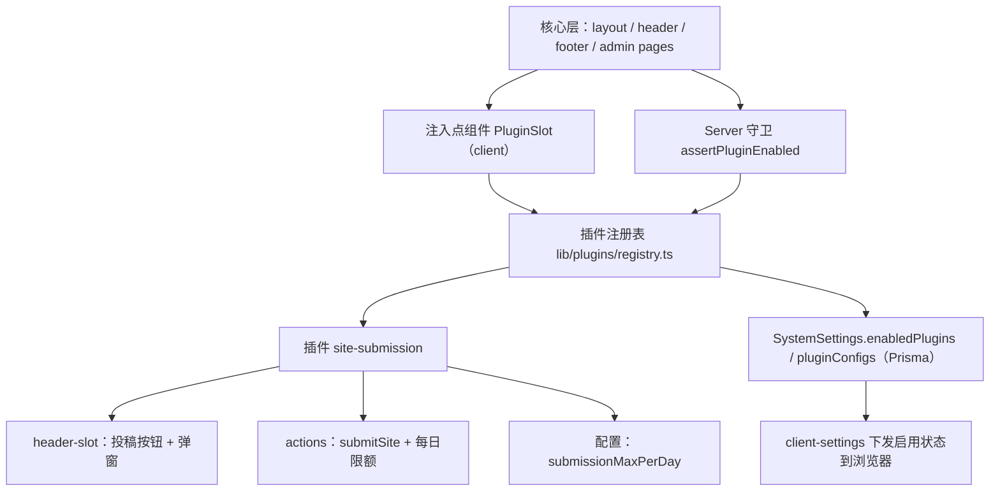

# Plugin System - 技术设计

Feature Name: plugin-system
Updated: 2026-08-28

## Description

在现有 Next.js 15 App Router 单体架构内实现轻量插件机制：插件以代码级注册表声明、以 `SystemSettings` 持久化启停状态、以 UI 注入点与后端守卫接入核心。第一期将「网站收录」整体迁移为内置插件 `site-submission`，核心代码中不再出现该功能的专有逻辑分支。设计目标是后续新增可选功能时，仅新增插件目录与注册表一行登记。

## Architecture



设计原则：

1. **声明式注册**：插件是满足 `PluginDefinition` 接口的 TypeScript 对象，在注册表数组中登记，编译期可校验唯一性与接口完整性。
2. **单向依赖**：插件可以 import 核心库（prisma、i18n、ui 组件）；核心与插件之间的引用只经过 `lib/plugins` 的类型与运行时工具，核心页面零插件 import。
3. **逻辑开关而非动态装载**：Next.js 构建产物固定，插件代码始终在 bundle 内；「禁用」是运行时行为开关（UI 隐藏 + 后端拒绝），schema 与迁移始终存在。这是单体 Prisma 部署下的现实约束，也满足「禁用保留数据、启用即恢复」的需求。

## Components and Interfaces

### 1. 插件类型与注册表

```
lib/plugins/
  types.ts        # PluginDefinition 类型
  registry.ts     # 内置插件清单
  server.ts       # 服务端运行时工具
  client.tsx      # 注入点组件（"use client"）
plugins/
  site-submission/
    index.ts          # 插件定义（元数据 + slot + 配置声明）
    header-slot.tsx   # "use client"：收录按钮 + 投稿弹窗（自 components/layout/site-submission-dialog.tsx 迁移）
    actions.ts        # "use server"：submitSite（自 lib/actions.ts 迁移）
    constants.ts      # 配置键、限额默认值
```

```ts
// lib/plugins/types.ts
import type { ComponentType } from "react"

export interface PluginConfigField {
  key: string                       // 如 "submissionMaxPerDay"
  labelKey: string                  // i18n key
  type: "number" | "string" | "boolean"
  defaultValue: number | string | boolean
  min?: number
  max?: number
}

export interface PluginDefinition {
  id: string                        // 全局唯一，如 "site-submission"
  nameKey: string                   // i18n: plugins.siteSubmission.name
  descriptionKey: string
  icon: ComponentType               // lucide 图标
  version: string
  author?: string
  defaultEnabled: boolean
  configFields: PluginConfigField[]
  headerSlot?: ComponentType        // 前台 header 工具区注入
  footerSlot?: ComponentType        // 预留
  serverActionIds?: string[]        // 声明的后端能力，用于守卫校验
}
```

```ts
// lib/plugins/registry.ts
import { siteSubmissionPlugin } from "@/plugins/site-submission"

export const pluginRegistry: PluginDefinition[] = [siteSubmissionPlugin]
```

### 2. 服务端运行时（lib/plugins/server.ts）

- `getPluginState(): Promise<Record<string, boolean>>`：读取 `SystemSettings.enabledPlugins`，与注册表 `defaultEnabled` 合并（缺省键取默认值）。
- `isPluginEnabled(id: string): Promise<boolean>`：注册表中未登记的 ID 一律视为禁用（向前兼容脏数据）。
- `assertPluginEnabled(id: string): Promise<void>`：守卫函数，禁用时抛出 `PluginDisabledError`，action 层捕获后返回统一的 `{ ok: false, code: "PLUGIN_DISABLED" }` 响应。
- `getPluginConfig<T>(id: string): Promise<T>`：读取 `pluginConfigs`，缺失键回退 `configFields` 的 `defaultValue`。
- `setPluginEnabled(id, enabled)` 与 `updatePluginConfig(id, patch)`：管理后台调用的 server action，写库后 `revalidatePath("/", "layout")`。

### 3. 客户端注入点（lib/plugins/client.tsx）

```tsx
"use client"
export function PluginHeaderSlot() {
  // 从 client-settings 读取 enabledPlugins（沿 useClientSettings 既有模式下发）
  // registry.filter(p => p.headerSlot && enabled(p.id)).map(...)
}
```

header.tsx 原「网站收录按钮」位置替换为 `<PluginHeaderSlot />`，实现核心与插件解耦。footer 同理预留 `<PluginFooterSlot />`（第一期无插件使用）。

### 4. 管理后台

- 新页面 `app/admin/(dash)/plugins/page.tsx`：卡片列表展示注册表插件（名称、描述、图标、版本），每卡一个启用 Switch；启用状态为 ON 的插件在卡片下方渲染其 `configFields` 表单。
- 侧边栏导航新增「插件管理」项。
- `app/admin/(dash)/sites/page.tsx`：「来源」列与按来源筛选包裹在 `isPluginEnabled("site-submission")` 条件渲染内（该字段属于核心 `Site` 模型，此处为显式标注的最小耦合点，注释注明归属插件）。

### 5. i18n

各语言 `messages/*.json` 新增命名空间 `plugins.registry`（管理页通用文案）与 `plugins.siteSubmission`（投稿流程文案，自现有 `submission` 命名空间迁移）。缺失语言键由 next-intl 回退机制兜底。

## Data Models

```prisma
model SystemSettings {
  // ... 既有字段
  enabledPlugins Json @default("[]") @map("enabled_plugins")   // 启用的插件 ID 数组
  pluginConfigs  Json @default("{}") @map("plugin_configs")    // { "site-submission": { submissionMaxPerDay: 3 } }
  // 废弃并删除：enableSubmission、submissionMaxPerDay（迁移时先写代码再删列）
}
```

迁移 `20260829000000_plugin_system`（单次迁移，依序）：

1. `ALTER TABLE "SystemSettings" ADD COLUMN "enabled_plugins" JSONB NOT NULL DEFAULT '[]'`
2. `ALTER TABLE "SystemSettings" ADD COLUMN "plugin_configs" JSONB NOT NULL DEFAULT '{}'`
3. `ALTER TABLE "SystemSettings" DROP COLUMN IF EXISTS "enable_submission"`
4. `ALTER TABLE "SystemSettings" DROP COLUMN IF EXISTS "submission_max_per_day"`

依既定决策，存量 `enableSubmission=true` 的系统升级后收录插件同为禁用，站长在插件页手动开启；发布说明中明确提示。

`Site.submitterContact / submitterIp` 列保留于 schema：禁用插件时数据留存，重新启用即恢复展示；插件禁用期间后台列表隐藏来源列。

## Correctness Properties

1. 注册表内插件 ID 唯一；`id` 与 `configFields[].key` 非空。
2. `enabledPlugins` 中出现注册表未登记的 ID 时，该 ID 视为禁用，运行时零异常。
3. 禁用插件的 server action 必定返回 `PLUGIN_DISABLED`，副作用为零（无写库、无限额消耗）。
4. 禁用与启用操作对 `Site` 投稿数据零删除、零改写。
5. `pluginConfigs` 缺失任一 `configFields` 键时，读取结果与 `defaultValue` 一致。
6. 前台任一渲染路径（首页、分类页、About 页）在插件禁用时均无收录入口 DOM。

## Error Handling

| 场景 | 处理 |
|------|------|
| 访客调用已禁用插件的 action | 捕获 `PluginDisabledError`，返回 `{ ok: false, code: "PLUGIN_DISABLED" }`，前端 toast 提示「功能未启用」 |
| `enabledPlugins` JSON 损坏 / 非数组 | `getPluginState` 捕获解析异常，回退为全部禁用并记录 `logger.warn` |
| `pluginConfigs` 中值越界（超出 min/max） | 读取时 clamp 到边界；写入时 zod 校验拒绝 |
| 注册表 ID 重复 | 开发期为运行时断言（`registry.ts` 顶部 dev check），构建期 fail-fast |
| 插件配置保存时插件处于禁用状态 | 允许保存（配置与状态独立持久化），启用后即生效 |

## Test Strategy

1. **单元测试（vitest）**
   - registry：ID 唯一性、必填元数据完整性、configFields 类型合法。
   - `lib/plugins/server.ts`：`getPluginState` 合并逻辑、脏 ID 过滤、JSON 损坏回退、`getPluginConfig` 默认值回退与 clamp。
   - site-submission 限额逻辑：跨日重置、按提交者维度计数（迁移自现有实现，回归保护）。
2. **集成测试（vitest + 内存 Prisma mock，沿 `lib/prisma.ts` 既有 `useRealDatabase` 模式）**
   - `submitSite`：启用状态正常投稿；禁用状态返回 `PLUGIN_DISABLED` 且 `Site` 无新增记录。
   - `setPluginEnabled`：写入后 `getPluginState` 与之一致。
3. **手动验收清单**
   - 管理页启停开关即时生效；禁用后前台 header 无入口、后台 sites 页无来源列。
   - 禁用 → 重新启用后，禁用前投稿记录完整可见。
   - 六语言下插件页与投稿弹窗文案完整。

## References

[^1]: (lib/actions.ts) - 现有 submitSite action 与每日限额实现，迁移来源
[^2]: (components/layout/site-submission-dialog.tsx) - 现有投稿弹窗组件，迁移为 header-slot
[^3]: (prisma/schema.prisma#L133) - SystemSettings 模型，enabledPlugins/pluginConfigs 挂载点
[^4]: (lib/client-settings.ts) - 客户端设置下发模式，插件启用状态复用该通道
[^5]: (app/admin/(dash)/users/page.tsx) - 管理后台设置页既有模式（Switch + 配置表单），插件管理页参照
