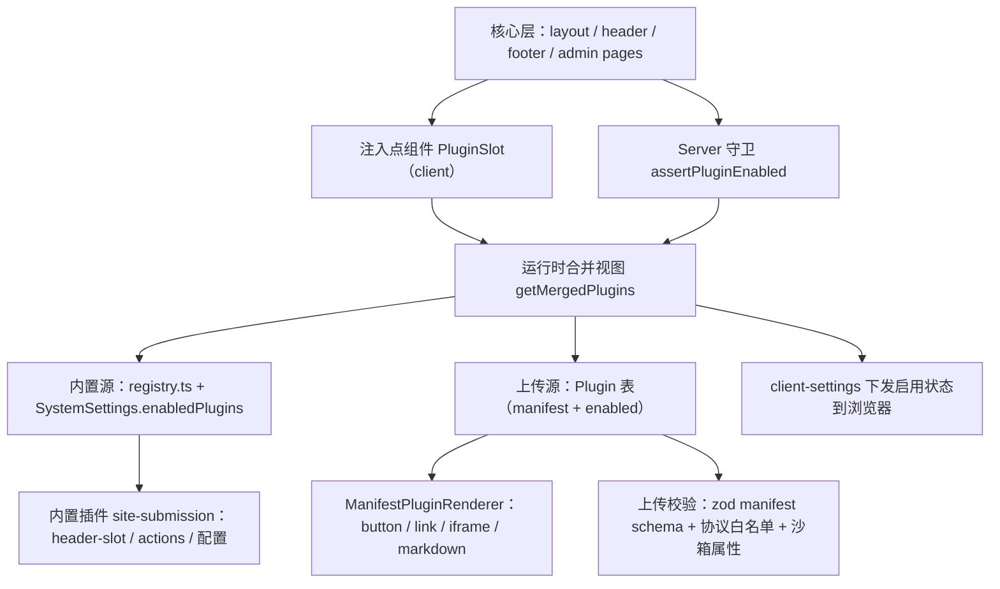

# Plugin System - 技术设计

Feature Name: plugin-system
Updated: 2026-08-28

## Description

在现有 Next.js 15 App Router 单体架构内实现轻量插件机制，插件分双源：

- **内置插件（Builtin）**：实现 `PluginDefinition` 接口的代码级插件，在注册表数组登记，启停状态存 `SystemSettings.enabledPlugins`。首个内置插件为「网站收录」`site-submission`。
- **上传插件（Uploaded）**：站长在管理后台上传的声明式 manifest 包，存 `Plugin` 表，自带 enabled 状态。UI 能力限定为按钮、链接、iframe 弹窗、Markdown 区块四种声明形态，后端交互限定为 manifest 声明的 HTTP(S) webhook 端点，运行时零任意代码执行。

核心代码通过统一的注入点与运行时合并视图消费两类插件。设计目标：新增内置插件仅新增目录与注册表一行；接入第三方扩展仅需上传 manifest，均无需修改核心代码。

## Architecture



设计原则：

1. **声明式注册**：内置插件是满足 `PluginDefinition` 接口的 TypeScript 对象，在注册表数组中登记，编译期可校验唯一性与接口完整性。
2. **单向依赖**：插件可以 import 核心库（prisma、i18n、ui 组件）；核心与插件之间的引用只经过 `lib/plugins` 的类型与运行时工具，核心页面零插件 import。
3. **逻辑开关而非动态装载**：Next.js 构建产物固定，内置插件代码始终在 bundle 内；「禁用」是运行时行为开关（UI 隐藏 + 后端拒绝），schema 与迁移始终存在。这是单体 Prisma 部署下的现实约束，也满足「禁用保留数据、启用即恢复」的需求。
4. **上传插件零代码执行**：manifest 是纯声明数据（zod 校验后的 JSON），UI 由通用渲染器 `ManifestPluginRenderer` 按声明渲染，服务端交互仅限对 manifest 声明端点的受限 HTTP 转发；iframe 注入强制 `sandbox` 与协议白名单。

## Components and Interfaces

### 1. 插件类型与注册表

```
lib/plugins/
  types.ts            # PluginDefinition / PluginConfigField / ManifestTypes 类型
  manifest-schema.ts  # 上传插件 manifest 的 zod schema 与校验
  registry.ts         # 内置插件清单（dev 断言 ID 唯一）
  server.ts           # 服务端运行时：双源合并、守卫、配置读取、上传/删除
  client.tsx          # 注入点组件（"use client"）+ ManifestPluginRenderer
plugins/
  site-submission/
    index.ts          # 插件定义（元数据 + slot + 配置声明）
    header-slot.tsx   # "use client"：收录按钮 + 投稿弹窗（自 components/layout/site-submission-dialog.tsx 迁移）
    actions.ts        # "use server"：submitSite（自 lib/actions.ts 迁移）
    constants.ts      # 配置键、限额默认值
```

```ts
// lib/plugins/types.ts
import type { ComponentType } from "react"

export interface PluginConfigField {
  key: string                       // 如 "submissionMaxPerDay"
  labelKey: string                  // i18n key
  type: "number" | "string" | "boolean"
  defaultValue: number | string | boolean
  min?: number
  max?: number
}

export interface PluginDefinition {
  id: string                        // 全局唯一，如 "site-submission"
  nameKey: string                   // i18n: plugins.siteSubmission.name
  descriptionKey: string
  icon: ComponentType               // lucide 图标
  version: string
  author?: string
  defaultEnabled: boolean
  configFields: PluginConfigField[]
  headerSlot?: ComponentType        // 前台 header 工具区注入
  footerSlot?: ComponentType        // 预留
  serverActionIds?: string[]        // 声明的后端能力，用于守卫校验
}
```

```ts
// lib/plugins/registry.ts
import { siteSubmissionPlugin } from "@/plugins/site-submission"

export const pluginRegistry: PluginDefinition[] = [siteSubmissionPlugin]
```

### 2. 服务端运行时（lib/plugins/server.ts）

- `getMergedPlugins(): Promise<MergedPlugin[]>`：内置注册表（状态取 `SystemSettings.enabledPlugins`）与上传插件（`Plugin` 表）双源合并，产出统一视图（id、名称、描述、版本、来源、enabled、configFields、slots）。
- `isPluginEnabled(id: string): Promise<boolean>`：合并视图中不存在或处于禁用状态均返回 false。
- `assertPluginEnabled(id: string): Promise<void>`：守卫函数，禁用时抛出 `PluginDisabledError`，action 层捕获后返回统一的 `{ ok: false, code: "PLUGIN_DISABLED" }` 响应。
- `getPluginConfig<T>(id: string): Promise<T>`：内置插件读 `pluginConfigs`，缺失键回退 `configFields` 的 `defaultValue`；上传插件读 `Plugin.configs`，回退 manifest `configFields` 默认值。
- `setPluginEnabled(id, enabled)` 与 `updatePluginConfig(id, patch)`：管理后台 server action，双源自适应（内置写 SystemSettings，上传写 Plugin 表），写库后 `revalidatePath("/", "layout")`。
- `uploadPluginManifest(json)`：admin 专用，zod 校验 manifest（ID 格式 `[a-z0-9-]`、与内置插件 ID 冲突检测、URL 协议白名单 http/https、manifest ≤ 64KB），通过后以 `enabled=false` 写入 Plugin 表。
- `deleteUploadedPlugin(id)`：仅允许删除上传源插件；内置插件 ID 一律拒绝。

### 2a. Manifest 插件（上传插件）

```ts
// lib/plugins/manifest-schema.ts（zod 摘要）
const manifestSchema = z.object({
  id: z.string().regex(/^[a-z0-9][a-z0-9-]{1,63}$/),
  name: z.string().min(1).max(64),
  description: z.string().max(256).optional(),
  version: z.string().max(32),
  author: z.string().max(64).optional(),
  icon: z.string().url().max(2048).optional(),
  slots: z.object({
    header: slotSchema,   // button | link | iframe | markdown 四种形态之一
    footer: slotSchema,
  }).partial().optional(),
  webhooks: z.record(z.string().url().regex(/^https?:\/\//)).optional(),
  configFields: z.array(configFieldSchema).max(20).optional(),
})
```

- **通用渲染器** `ManifestPluginRenderer`（lib/plugins/client.tsx 内）：按 slot 声明渲染四种形态。`button`：点击打开链接或 iframe 弹窗；`link`：文字链接；`iframe`：受控弹窗（`sandbox="allow-scripts allow-forms allow-popups"`，禁 `allow-same-origin`，强制 https）；`markdown`：复用 `MarkdownContent` 渲染 manifest 内嵌文案（长度上限 8KB）。
- **webhook 约定**：核心仅在明确的扩展点触发（第一期：`siteSubmitted`，投稿成功后 POST 插件端点，携带站点名称/URL/描述摘要，超时 5s、失败仅记录日志不阻塞投稿）。上传插件无核心 server action 能力。

### 3. 客户端注入点（lib/plugins/client.tsx）

```tsx
"use client"
export function PluginHeaderSlot() {
  // 从 client-settings 读取 enabledPlugins（沿 useClientSettings 既有模式下发）
  // registry.filter(p => p.headerSlot && enabled(p.id)).map(...)
}
```

header.tsx 原「网站收录按钮」位置替换为 `<PluginHeaderSlot />`，实现核心与插件解耦。footer 同理预留 `<PluginFooterSlot />`（第一期无插件使用）。

### 4. 管理后台

- 新页面 `app/admin/(dash)/plugins/page.tsx`：
  - 「已安装插件」卡片列表：合并视图（内置 + 上传），展示名称、描述、图标、版本、来源标记（内置 / 上传）；每卡一个启用 Switch；启用状态为 ON 的插件在卡片下方渲染其 `configFields` 表单。
  - 「上传插件」区：文件选择仅接受 `.json`，客户端先做基础校验，提交走 `uploadPluginManifest`；展示上传结果与失败原因。
  - 上传插件卡片提供「删除」操作（需确认），内置插件卡片隐藏删除。
- 侧边栏导航新增「插件管理」项。
- `app/admin/(dash)/sites/page.tsx`：「来源」列与按来源筛选包裹在 `isPluginEnabled("site-submission")` 条件渲染内（该字段属于核心 `Site` 模型，此处为显式标注的最小耦合点，注释注明归属插件）。

### 5. i18n

各语言 `messages/*.json` 新增命名空间 `plugins.registry`（管理页通用文案）与 `plugins.siteSubmission`（投稿流程文案，自现有 `submission` 命名空间迁移）。缺失语言键由 next-intl 回退机制兜底。

## Data Models

```prisma
model SystemSettings {
  // ... 既有字段
  enabledPlugins Json @default("[]") @map("enabled_plugins")   // 内置插件启用 ID 数组
  pluginConfigs  Json @default("{}") @map("plugin_configs")    // { "site-submission": { submissionMaxPerDay: 3 } }
  // 废弃并删除：enableSubmission、submissionMaxPerDay（迁移时先写代码再删列）
}

model Plugin {
  id        String   @id                 // manifest.id，全局唯一且与内置注册表冲突检测
  manifest  Json                         // 校验通过的完整 manifest
  enabled   Boolean  @default(false)     // 上传插件独立启停（内置插件状态存 SystemSettings）
  configs   Json     @default("{}")      // 上传插件配置项值
  createdAt DateTime @default(now()) @map("created_at")
  updatedAt DateTime @updatedAt @map("updated_at")

  @@map("Plugin")
}
```

迁移 `20260829000000_plugin_system`（单次迁移，依序）：

1. `ALTER TABLE "SystemSettings" ADD COLUMN "enabled_plugins" JSONB NOT NULL DEFAULT '[]'`
2. `ALTER TABLE "SystemSettings" ADD COLUMN "plugin_configs" JSONB NOT NULL DEFAULT '{}'`
3. `CREATE TABLE "Plugin" (...)`（含 id / manifest / enabled / configs / 时间戳）
4. `ALTER TABLE "Site" ADD COLUMN IF NOT EXISTS "submitter_contact" TEXT`、`"submitter_ip" TEXT`（PR #9 已删除这两列，随插件化恢复）
5. `ALTER TABLE "SystemSettings" DROP COLUMN IF EXISTS "enable_submission"`、`"submission_max_per_day"`（IF EXISTS 兼容两种基线）

依既定决策，存量 `enableSubmission=true` 的系统升级后收录插件同为禁用，站长在插件页手动开启；发布说明中明确提示。

`Site.submitterContact / submitterIp` 列保留于 schema：禁用插件时数据留存，重新启用即恢复展示；插件禁用期间后台列表隐藏来源列。

## Correctness Properties

1. 注册表内插件 ID 唯一；`id` 与 `configFields[].key` 非空。
2. `enabledPlugins` 中出现注册表未登记的 ID 时，该 ID 视为禁用，运行时零异常。
3. 禁用插件的 server action 必定返回 `PLUGIN_DISABLED`，副作用为零（无写库、无限额消耗）。
4. 禁用与启用操作对 `Site` 投稿数据零删除、零改写。
5. `pluginConfigs` 缺失任一 `configFields` 键时，读取结果与 `defaultValue` 一致。
6. 前台任一渲染路径（首页、分类页、About 页）在插件禁用时均无收录入口 DOM。
7. `Plugin.id` 与内置注册表任一 ID 冲突时，上传被拒绝且零写库。
8. manifest 中任何 URL 均为 http/https 协议；iframe 注入渲染结果必含 `sandbox` 属性且缺省排除 `allow-same-origin`。
9. `deleteUploadedPlugin` 对内置插件 ID 必定拒绝；删除上传插件零触碰 `SystemSettings` 与 `Site`。

## Error Handling

| 场景 | 处理 |
|------|------|
| 访客调用已禁用插件的 action | 捕获 `PluginDisabledError`，返回 `{ ok: false, code: "PLUGIN_DISABLED" }`，前端 toast 提示「功能未启用」 |
| `enabledPlugins` JSON 损坏 / 非数组 | `getMergedPlugins` 捕获解析异常，回退为全部禁用并记录 `logger.warn` |
| `pluginConfigs` 中值越界（超出 min/max） | 读取时 clamp 到边界；写入时 zod 校验拒绝 |
| manifest 校验失败 | 逐字段错误信息返回上传界面展示；零写库 |
| manifest 超过 64KB / 含非白名单协议 URL | 直接拒绝上传 |
| webhook 请求超时或失败 | 记录日志、不阻塞主流程（投稿仍成功） |
| 注册表 ID 重复 | 开发期为运行时断言（`registry.ts` 顶部 dev check），构建期 fail-fast |
| 插件配置保存时插件处于禁用状态 | 允许保存（配置与状态独立持久化），启用后即生效 |

## Test Strategy

1. **单元测试（vitest）**
   - registry：ID 唯一性、必填元数据完整性、configFields 类型合法。
   - `lib/plugins/server.ts`：`getPluginState` 合并逻辑、脏 ID 过滤、JSON 损坏回退、`getPluginConfig` 默认值回退与 clamp。
   - site-submission 限额逻辑：跨日重置、按提交者维度计数（迁移自现有实现，回归保护）。
2. **集成测试（vitest + 内存 Prisma mock，沿 `lib/prisma.ts` 既有 `useRealDatabase` 模式）**
   - `submitSite`：启用状态正常投稿；禁用状态返回 `PLUGIN_DISABLED` 且 `Site` 无新增记录。
   - `setPluginEnabled`：写入后 `getPluginState` 与之一致。
3. **手动验收清单**
   - 管理页启停开关即时生效；禁用后前台 header 无入口、后台 sites 页无来源列。
   - 禁用 → 重新启用后，禁用前投稿记录完整可见。
   - 六语言下插件页与投稿弹窗文案完整。

## References

[^1]: (lib/actions.ts) - 现有 submitSite action 与每日限额实现，迁移来源
[^2]: (components/layout/site-submission-dialog.tsx) - 现有投稿弹窗组件，迁移为 header-slot
[^3]: (prisma/schema.prisma#L133) - SystemSettings 模型，enabledPlugins/pluginConfigs 挂载点
[^4]: (lib/client-settings.ts) - 客户端设置下发模式，插件启用状态复用该通道
[^5]: (app/admin/(dash)/users/page.tsx) - 管理后台设置页既有模式（Switch + 配置表单），插件管理页参照
