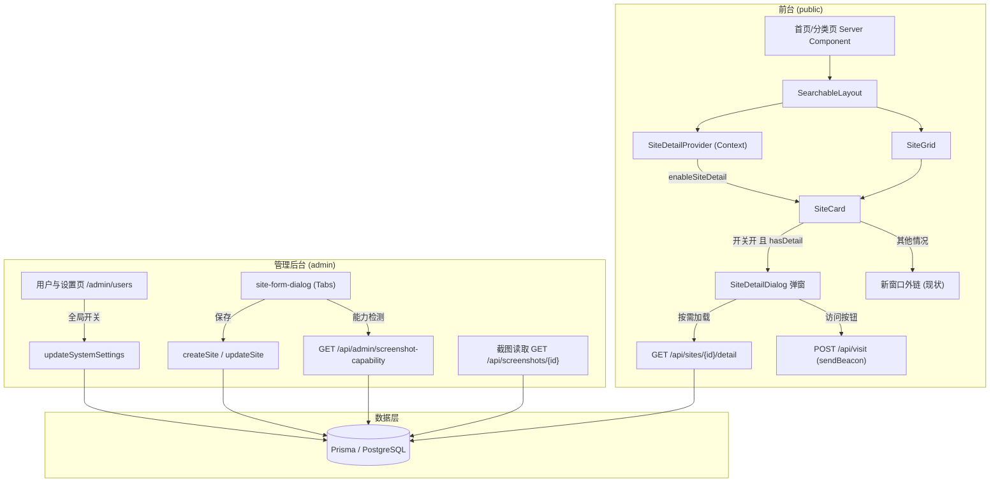

# 站点详情弹窗（二级跳转介绍）技术设计

Feature Name: site-detail-page
Updated: 2026-08-25

## Description

在不引入新路由的前提下，为导航站增加"站点详情弹窗"能力：全局开关 `enableSiteDetail` 开启后，已填写详情内容的站点卡片点击弹出图文详情弹窗（Markdown 介绍 + 截图画廊 + 访问按钮），未填写详情的站点保持直接外链跳转。管理后台提供全局开关、站点级 Markdown 编辑器与截图管理（URL 引用 + 数据库上传双通道，带环境能力检测）。

## Architecture



核心决策与理由：

| 决策 | 理由 |
|------|------|
| 弹窗而非独立路由 | 用户已确认；无 SEO 负担、零路由侵入、复用现有列表页渲染管线 |
| `hasDetail` 冗余布尔字段 | 首页/分类/搜索列表查询零额外成本，避免列表页拉取 Markdown 大字段与截图数据 |
| 弹窗内容按需 API 加载 | 列表页体积与数据库查询量最小化 |
| 截图独立 `Screenshot` 表 | base64 数据与 Site 行分离，列表查询、导出均可按需选择字段 |
| 保存时替换式重写截图 | 新建/编辑站点统一处理路径，逻辑简单，数据量小（导航站单站点截图个位数） |
| react-markdown + remark-gfm、不启用 rehype-raw | 满足 GFM 渲染需求；默认不渲染原始 HTML，从根上防 XSS |
| 上传能力 = 数据库写探测 | 覆盖"环境不支持数据库存储"场景（连接失败/只读），探测失败时 UI 自动降级为仅 URL |

## Components and Interfaces

### 1. 数据模型（prisma/schema.prisma）

```prisma
model Site {
  // ... 现有字段
  detailContent    String?   @map("detail_content")   // Markdown 文本
  hasDetail        Boolean   @default(false) @map("has_detail") // 冗余标志，保存时计算
  screenshots      Screenshot[]
}

model Screenshot {
  id        String   @id @default(cuid())
  siteId    String
  site      Site     @relation(fields: [siteId], references: [id], onDelete: Cascade)
  source    ScreenshotSource
  url       String?              // source=URL：外部图片地址
  data      String?              // source=UPLOAD：base64 编码图片
  mimeType  String?  @map("mime_type")
  order     Int      @default(0)
  createdAt DateTime @default(now())

  @@index([siteId])
  @@map("Screenshot")
}

enum ScreenshotSource {
  URL
  UPLOAD
}

model SystemSettings {
  // ... 现有字段
  enableSiteDetail Boolean @default(false) @map("enable_site_detail")
}
```

迁移注意：新增列均带默认值/可空，`prisma db push`/`migrate` 对存量数据无破坏。

### 2. 公开 API

| 端点 | 方法 | 说明 |
|------|------|------|
| `/api/sites/[id]/detail` | GET | 返回 `{ detailContent, screenshots: [{ id, source, url }] }`；仅对 `isPublished=true` 站点返回 200，否则 404。UPLOAD 类型截图的展示地址为 `/api/screenshots/{id}`，由服务端映射后返回 `displayUrl` 字段 |
| `/api/screenshots/[id]` | GET | 解码 base64 返回图片二进制；`Cache-Control: public, max-age=31536000, immutable`（cuid 不可枚举且记录不可变）。仅返回已发布站点关联的截图，否则 404 |
| `/api/settings` | GET | 现有端点自动携带 `enableSiteDetail`（实现为全量字段透传，无需改动） |

### 3. 管理 API / Server Actions

| 接口 | 说明 |
|------|------|
| `GET /api/admin/screenshot-capability` | 能力检测：`prisma.$transaction` 内写入并删除一条探测记录，验证数据库可写。结果服务端内存缓存 60 秒。返回 `{ supported: boolean, maxFileSize: 2097152, reason?: string }` |
| `createSite` / `updateSite`（actions.ts） | 入参扩展 `detailContent?: string`、`screenshots?: Array<{ source, url?, data?, mimeType? }>`；事务内：写 Site → `deleteMany` 旧截图 → `createMany` 新截图 → 计算 `hasDetail = (detailContent 非空 || 截图数 > 0)` |
| `updateSystemSettings` | zod schema 增加 `enableSiteDetail: z.boolean().optional()` |

Server Actions 体积限制：`next.config.js` 需设置 `experimental.serverActions.bodySizeLimit: '10mb'`，容纳 base64 截图提交（默认 1MB 会拒绝）。

### 4. 前台组件

**SiteDetailProvider（components/layout/site-detail-provider.tsx）**
- React Context，缓存 `enableSiteDetail`；初值可由服务端 props 注入（首页/分类页已调用 `getSystemSettings`，经 `SearchableLayout` 新 prop 传入），未注入时回退 `fetchPublicSettings()`
- 挂载于 `SearchableLayout`，`SiteCard` 通过 `useSiteDetail()` 消费

**SiteCard（改造）**
- `SiteItemProps` 增加 `hasDetail?: boolean`
- 点击行为分支：`enableSiteDetail && hasDetail` → `e.preventDefault()` 并打开弹窗；否则保持现有 `<Link href={site.url}>` 外链
- 弹窗状态提升：卡片自身持有 `SiteDetailDialog` 实例（懒渲染，`open` 时才 mount，避免列表页预载 50 个弹窗）

**SiteDetailDialog（components/layout/site-detail-dialog.tsx）**
- 基于现有 `ui/dialog`；`DialogContent` 加宽（`max-w-2xl`）、`max-h-[85vh]` 内部滚动；移动端全宽
- 打开时 fetch `/api/sites/{id}/detail`，加载态用 Skeleton
- 结构：头部（SiteIcon 复用 + 名称 + 分类 Badge + URL）→ 截图画廊（缩略图网格，点击进入 lightbox 全屏预览，Esc/遮罩关闭）→ `MarkdownContent` 渲染详情 → 底部主按钮"访问网站"（`window.open` + `sendBeacon('/api/visit')`，与现有卡片点击统计同源）
- 无 detailContent 但有截图（或反之）时分区各自省略，不渲染空块

**MarkdownContent（components/markdown-content.tsx）**
- 共享渲染组件：`react-markdown` + `remark-gfm`
- 组件覆写：`a` 加 `target="_blank" rel="noopener noreferrer"`；`img` 加 `loading="lazy"` + 加载失败占位样式
- 管理端预览与前台弹窗复用同一组件，所见即所得

### 5. 管理后台组件

**设置开关（app/admin/users/page.tsx 设置区）**
- 仿照现有 `enableSubmission` 开关模式增加"站点详情弹窗"Switch + 说明文案

**site-form-dialog（改造）**
- Dialog 加宽，表单改为 Tabs：「基本信息」（现有字段）+「详情内容」（功能开启时才显示该 Tab，关闭时整个 Tab 隐藏）
- 详情 Tab 内容：
  - Markdown 编辑器：Textarea + 「编辑/预览」子 Tabs（预览用 `MarkdownContent`）
  - 截图管理：URL 输入框 + 添加按钮；文件上传按钮（capability API 判定可用才启用，禁用时展示原因 tooltip）；截图列表（缩略图 + 上移/下移 + 删除）；上限 10 张
  - 前端校验：单文件 ≤ 2MB、类型白名单 png/jpg/jpeg/webp/gif/avif；上传项读为 base64 暂存于表单 state，随表单一并提交（后端二次校验）
- 编辑模式打开时按需拉取 `/api/sites/{id}/detail` 回填

### 6. 数据导入导出（actions.ts: exportData/importData）

- 导出：`sites` 数组各项增加 `detailContent`、`hasDetail`、`screenshots`（含 `source/url/data/mimeType/order`，UPLOAD 项含 base64）
- 导入：事务内重建 Site 时写入详情字段，`createMany` 截图记录；`data` 与 `url` 均按原值还原

### 7. 国际化（messages/*.json × 6）

- 新增 `siteDetail` 命名空间：visit / close / screenshots / loadError / retry / emptyHint 等
- `admin.siteForm` 增加：detailTab / detailContent / detailPlaceholder / preview / edit / addScreenshot / screenshotUrl / upload / uploadDisabled / screenshotLimit / detailHint（"留空则该站点保持直接跳转"）
- `admin.settings` 增加：enableSiteDetailLabel / enableSiteDetailDesc

## Data Models

见「Components and Interfaces → 数据模型」。数据流字段契约：

```typescript
// /api/sites/[id]/detail 响应
interface SiteDetailResponse {
  detailContent: string | null
  screenshots: Array<{
    id: string
    displayUrl: string   // URL 源为外部地址；UPLOAD 源为 /api/screenshots/{id}
    order: number
  }>
}

// createSite/updateSite 的截图入参
interface ScreenshotInput {
  source: "URL" | "UPLOAD"
  url?: string           // source=URL 必填
  data?: string          // source=UPLOAD 必填（base64）
  mimeType?: string
}
```

## Correctness Properties

1. `hasDetail === (detailContent 非空 || screenshots.length > 0)` 在每次 create/update/delete 站点或截图后恒成立（唯一写入口为 server action 事务）。
2. 功能关闭（`enableSiteDetail=false`）时，前台所有卡片行为与现状完全一致（外链 + visit 统计），后台详情编辑入口不可见但数据保留。
3. 未发布站点的详情 API、截图 API 均返回 404，与公开列表过滤口径一致。
4. Markdown 渲染管道不执行任何原始 HTML（无 `rehype-raw`），链接强制 `noopener noreferrer`。
5. UPLOAD 截图记录必含 `data` 与 `mimeType`；URL 记录必含 `url`（server action 内 zod 校验）。
6. 删除站点时 `onDelete: Cascade` 级联清理截图，无孤儿记录。
7. 单站点截图数 ≤ 10；单文件 ≤ 2MB；类型在白名单内（前端 + 后端双重校验）。

## Error Handling

| 场景 | 处理 |
|------|------|
| 弹窗详情 API 请求失败 | 弹窗内展示错误提示 + 「重试」按钮，不阻塞关闭 |
| 截图图片加载失败 | `onError` 替换为占位样式（灰底 + 图标），画廊其余项不受影响 |
| 能力检测失败/超时 | 上传按钮禁用并提示原因，URL 添加方式始终可用 |
| 保存时 base64 超限或类型非法 | server action 返回明确错误消息，toast 展示，表单不关闭 |
| 上传文件读取失败（客户端 FileReader） | toast 报错，不入列表 |
| server action body 超 bodySizeLimit | 返回 413 类错误消息，提示改用 URL 方式 |

## Test Strategy

项目无单元测试框架，采用以下验证组合：

1. **Lint/类型检查**：`npm run lint` + `npx tsc --noEmit` 全绿。
2. **构建验证**：`npm run build` 通过（含 OpenNext postbuild 链路）。
3. **数据库迁移验证**：`npx prisma db push` 成功，seed 数据不受影响。
4. **手动冒烟（核心路径）**：
   - 开关关闭：卡片点击 = 现状外链；后台无详情 Tab；数据保留
   - 开关开启 + 站点有详情：点击弹窗 → Markdown/截图渲染 → lightbox → 访问按钮新窗口 + Visit 计数 +1（后台仪表盘验证）
   - 开关开启 + 站点无详情：点击直接外链
   - Markdown XSS 样本（`<script>alert(1)</script>`、`[x](javascript:alert(1))`）不被执行
   - URL 添加截图 / 上传截图（含 >2MB 拒绝、类型拒绝）、排序、删除、替换保存
   - 数据导出 → 清库 → 导入 round-trip，详情与截图完整还原
   - 移动端视口（375px）弹窗布局与 Esc/遮罩关闭
5. **i18n**：6 个 locale 切换检查新增文案。

## References

- 现状站点卡片与外链行为：`components/layout/site-card.tsx:219-283`
- 站点 server actions（扩展点）：`lib/actions.ts:326-394`
- 系统设置读写（扩展点）：`lib/actions.ts:590-614`、`app/api/settings/route.ts:5-17`
- 公开设置客户端缓存：`lib/client-settings.ts:45-71`
- 首页数据流：`app/(public)/page.tsx:11-26` → `components/layout/searchable-layout.tsx`
- 管理设置开关 UI 模式（仿照对象）：`app/admin/users/page.tsx`
- 站点编辑表单（扩展点）：`components/admin/site-form-dialog.tsx`
- 数据导入导出（扩展点）：`lib/actions.ts:808+`
