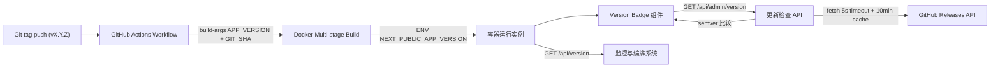

# 版本号显示与更新检查

Feature Name: version-display-update-check
Updated: 2026-08-26

## Description

为 Conan Nav 提供端到端的版本可观测能力：构建时把 Git tag 版本号注入镜像内的应用，管理后台侧边栏常驻展示当前版本，并通过服务端代理查询 GitHub Releases API 自动检查新版本，检测到更新时展示提示条与跳转链接。同时提供独立于数据库的公开版本查询 API，供监控与编排系统使用。

## Architecture



版本注入链路：

1. CI 在现有 `docker-release.yml` 的 build-push 步骤追加 `build-args: APP_VERSION=${VERSION}, GIT_SHA=${{ github.sha }}`（`.github/workflows/docker-release.yml:39`）。
2. Dockerfile 两阶段声明同名 `ARG`：
   - Builder 阶段设置 `ENV NEXT_PUBLIC_APP_VERSION=${APP_VERSION}`，使 `next build` 将版本内联进客户端 bundle（客户端组件可直接读取）；
   - Runner 阶段设置相同 `ENV`，使 standalone 服务端运行时通过 `process.env` 读取到同源版本。
3. 两阶段变量同源于同一 build-arg，保证客户端内联值与服务端运行时值一致。
4. 本地 `npm run dev` 时变量缺失，统一回退为 `dev` 标识。

## Components and Interfaces

### 1. `lib/version.ts`（新增，纯工具模块）

| 导出 | 签名 | 说明 |
|------|------|------|
| `UPSTREAM_REPO` | `const "kenanlabs/nav"` | 更新检查目标仓库 |
| `RELEASE_API_URL` | `const` | `https://api.github.com/repos/kenanlabs/nav/releases/latest` |
| `RELEASE_PAGE_URL` | `const` | `https://github.com/kenanlabs/nav/releases/latest` |
| `getAppVersion()` | `() => string` | 读 `process.env.NEXT_PUBLIC_APP_VERSION`，缺失返回 `"dev"` |
| `getGitSha()` | `() => string` | 读 `process.env.NEXT_PUBLIC_GIT_SHA`，缺失返回空串 |
| `isDevVersion()` | `() => boolean` | 当前版本为 `dev` 或无法解析为 semver |
| `parseSemver(v)` | `(v: string) => [number, number, number] \| null` | 宽松解析 `v?X.Y.Z`，忽略预发布后缀，失败返回 null |
| `compareSemver(a, b)` | `(a, b: string) => number` | 返回 -1/0/1；任一无法解析返回 NaN |

模块无副作用、无外部依赖，客户端与服务端均可安全引用。

### 2. `app/api/version/route.ts`（新增，公开只读）

- `GET` 返回 `{ version, isDev, gitSha, timestamp }`，不触碰数据库，无数据库模式下正常响应。
- 供监控探活、`docker inspect` 之外的应用层版本核验使用。

### 3. `app/api/admin/version/route.ts`（新增，管理端更新检查）

- `GET`，校验 cookie `user_id` 与 `user_role=ADMIN` 存在（与 `middleware.ts:20` 同强度，无需查库）。
- 服务端代理请求 GitHub API，数据源聚合策略：
  1. 优先 `GET /repos/kenanlabs/nav/releases/latest`（已发布 Release 时命中，跳转链接使用 Release 页面 `html_url`）；
  2. 返回 404 时回退 `GET /repos/kenanlabs/nav/tags?per_page=100`，服务端遍历解析 semver 并取最大者作为最新版本（实测上游仓库当前仅有 tags、无 Release，此路径为常态路径），跳转链接固定为 releases 列表页。
- 请求头带 `Accept: application/vnd.github+json` 与 UA；`AbortSignal.timeout(5000)` 超时控制。
- 模块级内存缓存：`{ data, expiresAt }`，TTL 600 秒，进程内所有请求共享。
- 响应结构：

```json
{
  "current": "v0.2.1",
  "isDev": false,
  "latest": "v0.3.0",
  "hasUpdate": true,
  "releaseUrl": "https://github.com/kenanlabs/nav/releases/latest",
  "checkAvailable": true,
  "checkedAt": "2026-08-26T00:00:00.000Z"
}
```

- GitHub 请求失败时返回 HTTP 200 + `checkAvailable: false`，避免客户端告警噪音，UI 静默降级。
- `isDev` 为 true 时跳过比较，`hasUpdate` 固定为 `false`。

### 4. `components/admin/version-badge.tsx`（新增，客户端组件）

- 当前版本号在客户端 bundle 中内联读取（构建期 `NEXT_PUBLIC_` 替换），首屏零请求即可渲染版本号。
- `useEffect` 中 `fetch("/api/admin/version")` 获取更新状态，组件卸载时忽略迟到响应。
- 四种展示状态：
  - `dev`：徽标样式 `dev`，不发起比较；
  - `hasUpdate`：高亮徽标 + 新版本号 + 外链 Release 页（`ArrowUpCircle` 图标）；
  - 已是最新：弱化样式 + `CheckCircle2` 图标；
  - 检查不可用：弱化样式 + `CircleOff` 图标，无提示弹窗。
- 外链 `target="_blank" rel="noopener noreferrer"`。

### 5. `components/admin/admin-sidebar.tsx`（修改）

在 `SidebarFooter`（`components/admin/admin-sidebar.tsx:139`）的 `AdminAvatar` 上方插入 `VersionBadge`，侧边栏折叠为 icon 模式时仅展示图标徽标。

### 6. i18n 文案（`messages/*.json` ×6）

在 `admin.sidebar` 命名空间下新增 `version` 子命名空间：

| key | zh 文案 |
|-----|---------|
| `version.current` | 当前版本 |
| `version.latest` | 已是最新版本 |
| `version.updateAvailable` | 发现新版本 {version} |
| `version.unavailable` | 版本检查不可用 |
| `version.dev` | 开发版本 |

en/ja/ko/de/fr 提供对应翻译。

## Data Models

无数据库 schema 变更。版本信息生命周期如下：

| 数据 | 来源 | 存储 | 生命周期 |
|------|------|------|----------|
| 当前版本 / Git SHA | 构建期 build-arg | 镜像 ENV + 客户端 bundle 内联 | 镜像不可变 |
| 最新 Release 版本 | GitHub API | API 路由模块级内存缓存 | TTL 600 秒 |
| 更新检查状态 | 客户端派生 | 组件 state | 页面会话 |

## Correctness Properties

1. 客户端内联版本与服务端 `process.env` 版本同源于同一 build-arg，构建产物内两者恒一致。
2. `parseSemver` 对 `v0.2.1`、`0.2.1`、`v1.2.3-beta` 均能提取主次修订号；对 `dev`、`test` 等返回 null，且调用方据此跳过比较。
3. `compareSemver` 满足传递性与反对称性；相等版本返回 0。
4. 更新检查结果在缓存 TTL 内对同进程所有请求幂等。
5. 版本能力独立于数据库：`DATABASE_URL` 缺失时 `/api/version` 与版本徽标仍正常工作。

## Error Handling

| 场景 | 行为 |
|------|------|
| GitHub API 超时（>5s） | 中止请求，返回 `checkAvailable: false`，UI 显示"版本检查不可用" |
| GitHub 限流（403/429） | 同上，缓存该失败结果 600 秒以退避 |
| 仓库无 Release / 404 | 同上 |
| 当前版本为 dev | 跳过比较，展示 dev 徽标 |
| API 路由异常 | 返回 200 + `checkAvailable: false`，徽标静默降级，管理后台其余功能不受影响 |
| 未认证访问 `/api/admin/version` | 返回 401 |

## Test Strategy

1. 单元逻辑：`parseSemver` / `compareSemver` 覆盖正常 tag、无 v 前缀、预发布后缀、非法输入、相等版本用例。
2. 本地 dev 验证：`npm run dev` 后访问 `/api/version` 应返回 `version: "dev"`、`isDev: true`；侧边栏显示 dev 徽标。
3. 构建注入验证：`docker build --build-arg APP_VERSION=v0.2.1 --build-arg GIT_SHA=test .` 后启动容器，`GET /api/version` 应返回注入值；管理后台侧边栏应显示同版本。
4. 更新检查验证：mock 或实际访问 GitHub API，验证三种状态（有更新 / 已最新 / 不可用）的 UI 渲染与缓存行为（第二次请求不触发外部调用）。
5. 静态检查：`npm run lint` 与 `npx tsc --noEmit` 通过。
6. i18n 验证：切换六种语言确认版本文案完整。

## References

[^1]: (Filename) - CI 工作流，build-args 注入点 `.github/workflows/docker-release.yml`
[^2]: (Filename) - 多阶段构建，ARG/ENV 声明点 `Dockerfile`
[^3]: (Filename) - 管理路由保护与 cookie 校验模式 `middleware.ts`
[^4]: (Filename) - 侧边栏插载点 `components/admin/admin-sidebar.tsx`
