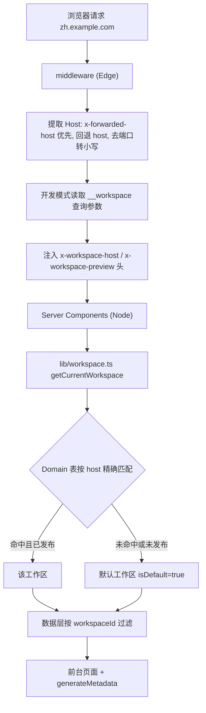

# 工作区与子域名路由技术设计

Feature Name: 2026-08-27-workspace-subdomain-routing
Updated: 2026-08-27

## Description

为 Conan Nav 引入多工作区（Multi-Workspace）能力：工作区是独立的导航内容空间（标题、描述、Logo、Favicon、分类、网址），通过精确域名绑定映射子域名；未匹配域名或命中未发布工作区时回退默认工作区。管理后台通过顶栏切换器按工作区上下文维护数据；统计、提交、sitemap、导入导出均区分工作区。

## Architecture



关键架构决策：

1. **middleware 零 IO**：middleware 运行于 Edge Runtime，无法使用 Prisma。因此 middleware 只做纯字符串处理（Host 提取、规范化、查询参数识别）并注入请求头；工作区解析统一在 Node 侧 `lib/workspace.ts` 完成并使用 React `cache()` 做请求内复用。Domain 表按唯一索引 host 查询为微秒级，跨请求缓存收益低于缓存失效复杂度（域名变更需立即生效）。
2. **Site 经 Category 隐式归属工作区**：不冗余 `Site.workspaceId`，查询经 `Category.workspaceId` 过滤，避免双写不一致。Visit 同理，统计经 `Site → Category → Workspace` 关系推导。
3. **后台上下文用 Cookie**：`admin_workspace_id` Cookie 保存后台当前选中的工作区；前台用请求头，后台用 Cookie，两套解析入口互不干扰。

## Components and Interfaces

### 1. middleware.ts（改造）

- matcher 从 `/admin/:path*` 扩展为 `["/((?!_next/static|_next/image|favicon.ico|api/health).*)"]`，保留原有 admin 鉴权逻辑
- 新增逻辑：`normalizeHost(raw)` 去协议、去端口、转小写 → 写入 `x-workspace-host` 请求头；开发模式（`NODE_ENV=development` 或 `ENABLE_WORKSPACE_PREVIEW=true`）下若存在 `__workspace` 查询参数则写入 `x-workspace-preview=<slug>`
- 纯字符串处理，无数据库访问

### 2. lib/workspace.ts（新增）

```ts
// 请求内缓存：同一请求多次调用只查一次库
export const getCurrentWorkspace = cache(async (): Promise<WorkspaceWithDefaults> => {
  // 1. 读 headers(): x-workspace-preview（开发模式）优先
  // 2. 否则按 x-workspace-host 查 Domain.workspaceId
  // 3. 命中且 isPublished=true → 该工作区；否则 → isDefault 工作区
  // 4. 数据库无任何工作区（未跑迁移）→ 返回内存兜底对象，保证可用性
})

// 后台用：读 admin_workspace_id Cookie，校验存在性，回退默认工作区
export async function getAdminWorkspace(): Promise<Workspace>

// 工具：host 规范化（去协议/端口/路径、小写、格式校验）
export function normalizeHost(input: string): string | null
```

### 3. lib/actions.ts（改造）

前台查询统一接收工作区上下文：

- `getCategories` / `getAllCategories` / `getSites` / `getCategoryBySlug` / 搜索：内部调用 `getCurrentWorkspace()`，Prisma where 增加 `workspaceId`
- `createCategory`：`workspaceId` 取 `getAdminWorkspace()`
- 分类 slug 唯一性校验从全局改为「同工作区内」

新增工作区 Server Actions（均先过 `requireAdmin()`）：

- `getWorkspaces()` / `createWorkspace` / `updateWorkspace` / `deleteWorkspace`
- `setPrimaryWorkspace`（设默认，事务内先清后设，保证唯一默认）
- `addWorkspaceDomain` / `removeWorkspaceDomain`（host 规范化 + 冲突检测）
- `exportData(mode: "workspace" | "full")`：workspace 模式导出当前后台选中工作区；full 模式导出含 Workspace/Domain 结构的全量备份
- `importData`：识别备份文件是否含 `workspaces` 节点，分别走全量恢复或按当前工作区导入

### 4. 前台页面（改造）

- `app/layout.tsx` `generateMetadata`：标题/描述/Favicon 取「工作区覆盖值 → 回退 SystemSettings」
- `app/(public)/page.tsx`、`app/(public)/category/[slug]/page.tsx`、`app/(public)/search/page.tsx`：查询自动带工作区过滤（actions 内部处理，页面代码基本零改动）
- `header` 的 siteName/siteLogo 传参改为工作区覆盖值

### 5. app/sitemap.ts / robots.ts（改造）

- 读 `headers()` 取当前 Host 作为 baseUrl（替换 `NEXTAUTH_URL` 硬编码），仅输出当前工作区已发布分类的 URL

### 6. 管理后台（新增 + 改造）

- `app/admin/workspaces/page.tsx`（新增）：工作区列表（名称、slug、域名、默认、发布状态）、创建/编辑对话框、域名管理（行内增删）、设为默认、发布开关
- `components/admin/workspace-switcher.tsx`（新增）：顶栏下拉，切换写 `admin_workspace_id` Cookie 后 `router.refresh()`
- `app/admin/layout.tsx`：顶栏挂载切换器
- `app/admin/categories|sites|data`：按 `getAdminWorkspace()` 过滤；数据页提供「按工作区 / 全量备份」导出与对应导入模式
- 仪表盘统计：增加工作区维度筛选（Visit 经关系聚合）

### 7. 网址提交（改造）

- 提交对话框的分类选项仅列出当前工作区的分类；提交记录随 categoryId 天然归属当前工作区

## Data Models

```prisma
model Workspace {
  id              String     @id @default(cuid())
  slug            String     @unique
  name            String
  description     String?
  siteName        String?                      // 覆盖标题，空则回退全局
  siteDescription String?    @map("site_description")
  siteLogo        String?    @map("site_logo")
  favicon         String?
  isDefault       Boolean    @default(false)
  isPublished     Boolean    @default(false)   // 未发布对前台回退默认区
  order           Int        @default(0)
  domains         Domain[]
  categories      Category[]
  createdAt       DateTime   @default(now())
  updatedAt       DateTime   @updatedAt

  @@map("Workspace")
}

model Domain {
  id          String    @id @default(cuid())
  host        String    @unique               // 规范化: 小写、无协议、无端口
  isPrimary   Boolean   @default(false)       // 该工作区的主域名（展示用）
  workspaceId String
  workspace   Workspace @relation(fields: [workspaceId], references: [id], onDelete: Cascade)
  createdAt   DateTime  @default(now())

  @@index([workspaceId])
  @@map("Domain")
}

model Category {
  // ...
  workspaceId String
  workspace   Workspace @relation(fields: [workspaceId], references: [id])
  // slug @unique 改为复合唯一:
  @@unique([workspaceId, slug])
}
```

Visit 不加冗余字段，统计经 `visit.site.category.workspaceId` 推导。

### 迁移 SQL（单次迁移）

1. 建 `Workspace`、`Domain` 表
2. 插入默认工作区（slug=`default`，isDefault=true，isPublished=true，siteName 取 SystemSettings 当前值）
3. `Category` 加 `workspace_id` 列并全部指向默认工作区
4. 删除 `Category.slug` 全局唯一约束，建立 `(workspace_id, slug)` 复合唯一

## Correctness Properties

1. 系统中恒有且仅有一个 `isDefault=true` 的工作区（设默认使用事务：先 UPDATE 全部置 false，再 UPDATE 目标置 true）
2. `Domain.host` 全局唯一：一个主机名至多映射一个工作区（应用层预检 + 数据库约束双保险）
3. `(workspaceId, slug)` 唯一：同工作区内分类 slug 唯一，跨工作区可重名
4. 默认工作区与含分类的工作区拒绝删除（onDelete: Restrict 语义，应用层预检给出可读错误）
5. 前台任何入口（首页、分类页、搜索、sitemap、metadata）对未发布工作区的行为与未匹配一致：渲染默认工作区
6. 生产环境忽略 `__workspace` 查询参数
7. 存量数据迁移后，未配置任何域名绑定时所有请求走默认工作区，渲染结果与升级前一致

## Error Handling

| 场景 | 处理 |
|------|------|
| 域名绑定的 host 已被其他工作区占用 | 422 返回「该域名已绑定到工作区 X」 |
| host 含协议/端口/路径/大写 | 入库前 `normalizeHost` 清洗；非法格式返回校验错误 |
| slug 格式非法 | 校验 `^[a-z0-9](?:[a-z0-9-]*[a-z0-9])?$` |
| 删除默认工作区 / 含分类的工作区 | 拒绝并提示先转移或删除其分类 |
| 数据库无工作区记录（迁移未执行） | `getCurrentWorkspace` 返回内存兜底对象，站点仍可访问，日志告警 |
| 开发模式 `__workspace` 指向不存在/未发布 slug | 回退默认工作区 |
| 导入文件的工作区结构与现存域名冲突 | 全量导入按 slug 匹配 upsert，域名冲突项跳过并在结果中报告 |

## Test Strategy

1. **单元验证（纯函数）**：`normalizeHost`（协议剥离、端口剥离、大小写、非法输入）、slug 校验
2. **手动验收（开发环境）**：
   - `curl -H "Host: zh.example.com" localhost:3000/` 命中中文站工作区；未绑定 Host 命中默认工作区
   - `localhost:3000/?__workspace=ai` 开发模式预览 AI 工作区
   - 未发布工作区 + 已绑定域名 → 显示默认工作区
   - 后台切换器切换后，分类/网址列表仅显示所选工作区数据
   - 同名 slug 分类在两个工作区各自可访问 `/category/tools`
   - 导出（按工作区 / 全量）→ 导入回灌一致性
3. **迁移验证**：对存量库跑迁移，确认默认工作区创建、分类归属、唯一约束替换
4. **回归**：无域名绑定单站场景下全站行为与升级前一致（含 i18n、提交、统计）

## References

- 现有数据模型: prisma/schema.prisma
- 现有鉴权中间件: middleware.ts
- 前台数据入口: lib/actions.ts（getCategories/getSites 等）
- 全局设置: lib/actions.ts:1129（getSystemSettings）
- 导入导出: app/api/data/export/route.ts, app/api/data/import/route.ts
- sitemap: app/sitemap.ts
